# ISP Network Fault Simulation Lab
**Tools:** Cisco Packet Tracer | OSPF | DHCP | Static IP | Subnetting

## Overview
Built a 3-site ISP network topology simulating residential and business 
infrastructure. Configured OSPF dynamic routing between 3 routers, set up 
DHCP pools for residential accounts, and assigned a static IP for a business 
account. Simulated real NOC fault scenarios including network outages, power 
failures, and router upgrades with full service restoration verified each time.

## Network Topology
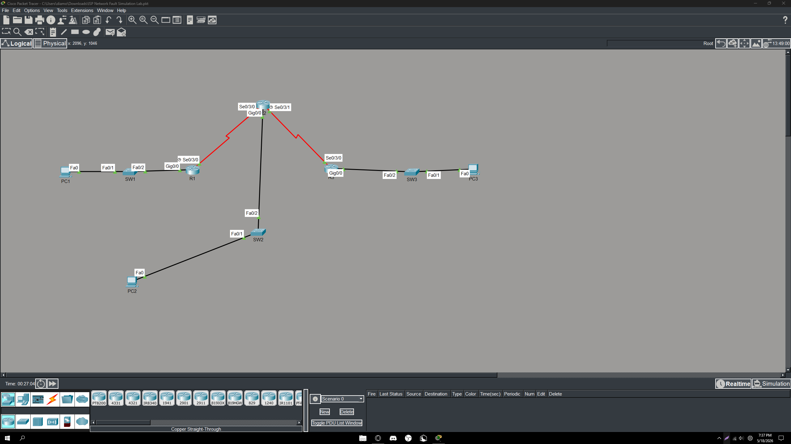

---

## IP Address Scheme
| Device | Interface | IP Address | Role |
|---|---|---|---|
| R1 | Gi0/0 | 192.168.1.1 | Site 1 Gateway |
| R2 | Gi0/0 | 192.168.2.1 | Site 2 Gateway |
| R3 | Gi0/0 | 192.168.3.1 | Site 3 Gateway |
| R1-R2 Link | Se0/3/0 | 10.0.0.0/30 | WAN Link |
| R2-R3 Link | Se0/3/1 | 10.0.1.0/30 | WAN Link |
| PC1 | NIC | DHCP | Residential Account |
| PC2 | NIC | DHCP | Residential Account |
| PC3 | NIC | 192.168.3.50 | Business Static IP |

---

## OSPF Routing Tables
All three routers learned each other's networks dynamically via OSPF.
O routes confirm successful neighbor adjacency and route propagation.

**R1 Routing Table**
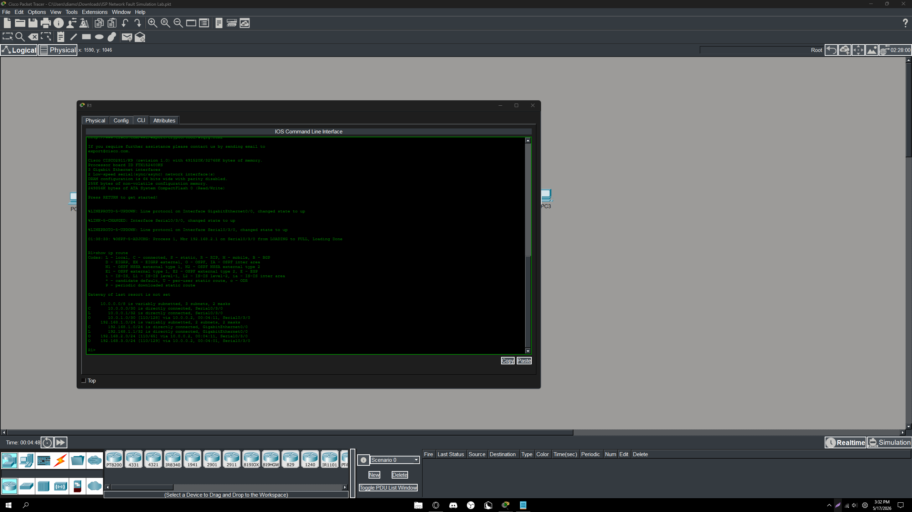

**R2 Routing Table**
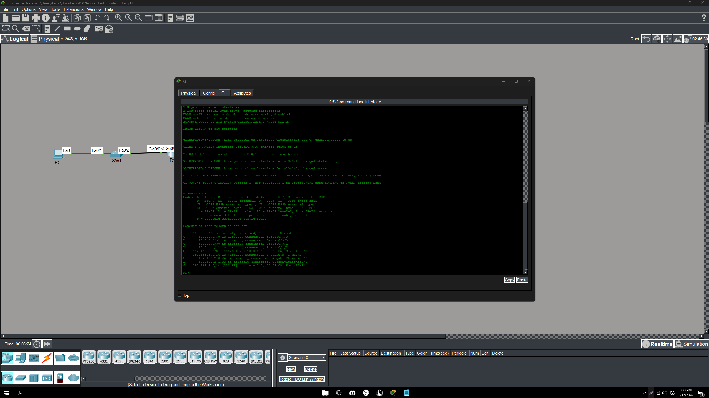

**R3 Routing Table**

---

## DHCP Configuration
Configured DHCP pools on each router for residential accounts.
Business account on PC3 excluded from the pool with a static IP of 192.168.3.50.

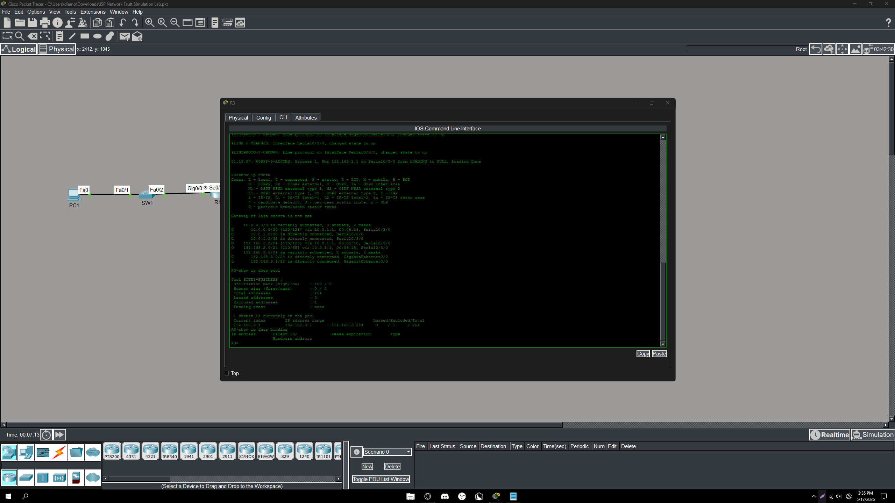

---

## End-to-End Connectivity Test
Verified full connectivity from Site 1 to Site 3 across the entire network.

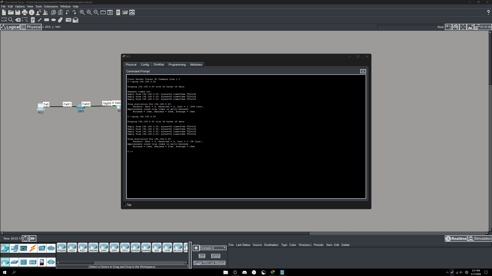

---

## Fault Scenarios

### Scenario 1 — Network Outage
Simulated a full site outage by shutting down R1's serial link.
OSPF route to 192.168.1.0 disappeared from R2's routing table.
Restored the link and verified OSPF reconvergence.

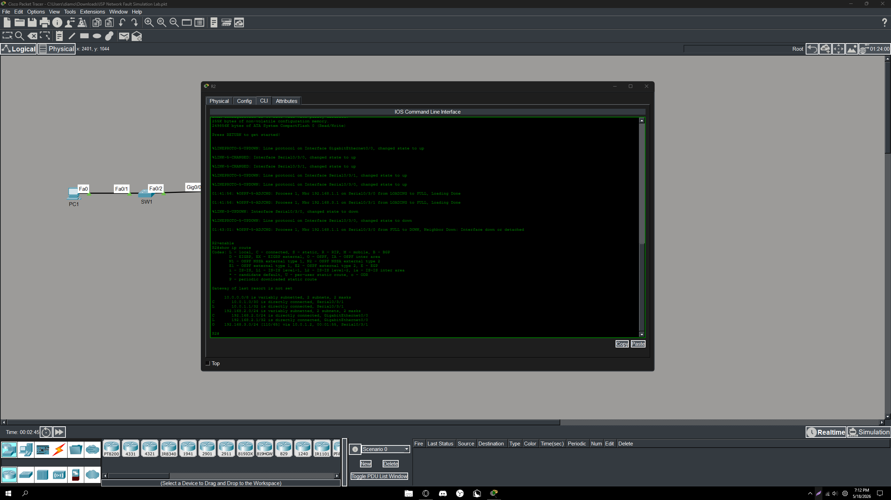
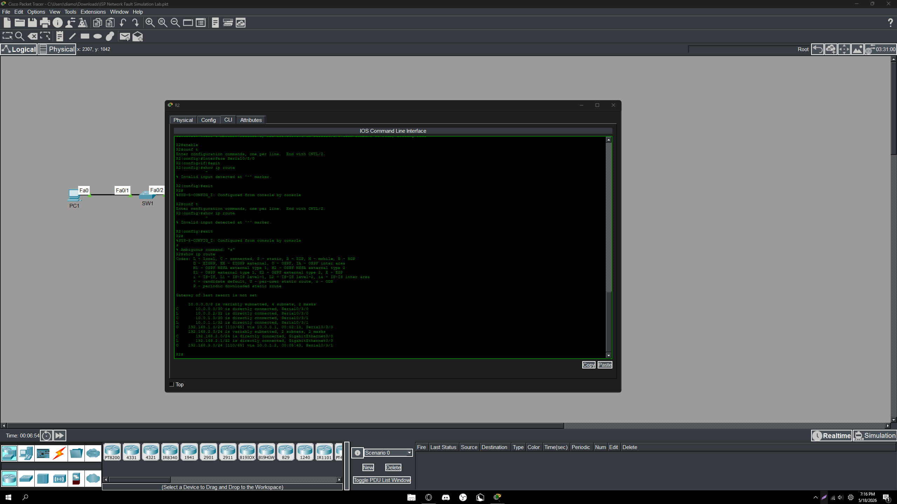

---

### Scenario 2 — Power Issue
Shut down both serial interfaces on R2 simulating a complete power failure.
All OSPF routes dropped across the entire network.
Restored both links and verified full network recovery.

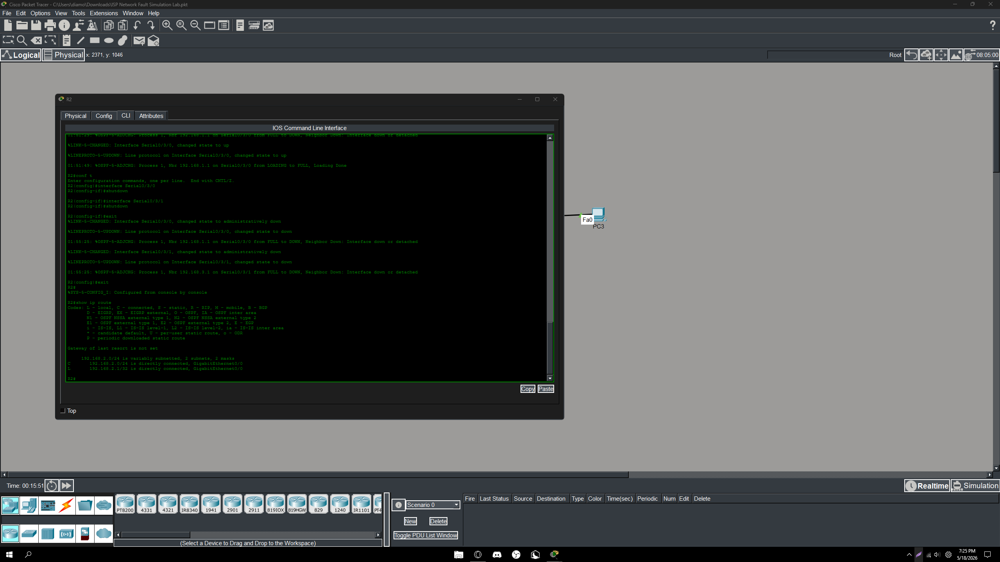
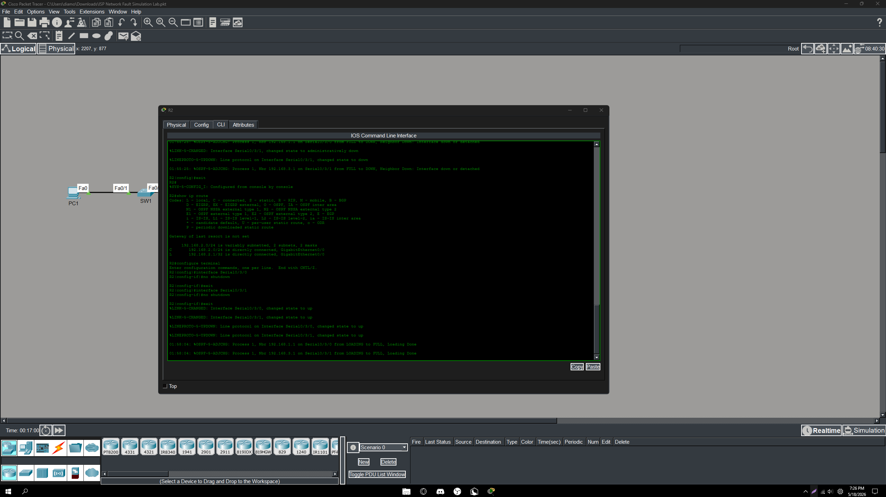

---

### Scenario 3 — Router Upgrade
Erased R1's configuration and reloaded it simulating a full router replacement.
Reconfigured R1 from scratch including OSPF, DHCP, and interface IPs.
Verified OSPF reconvergence and end-to-end connectivity after restoration.

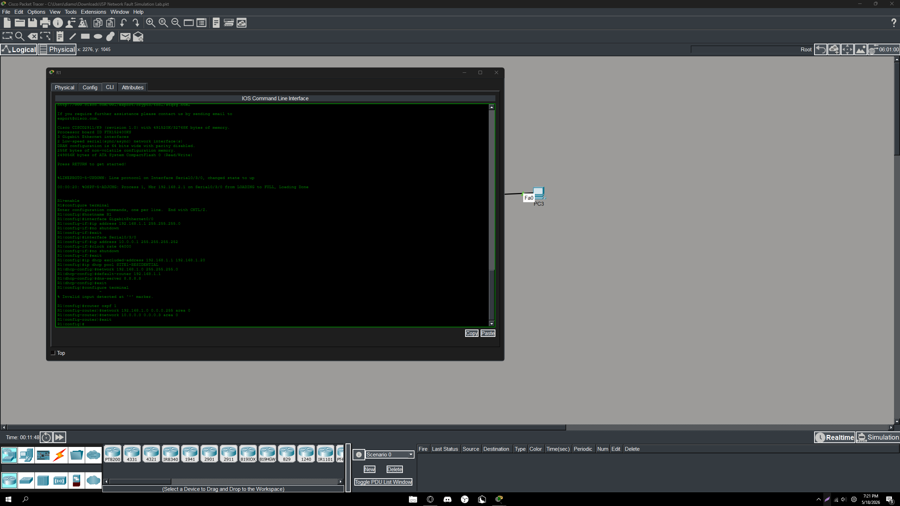
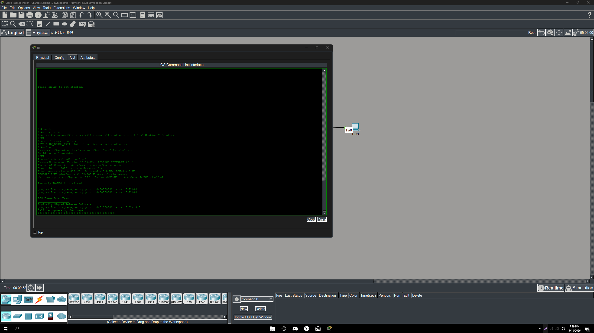
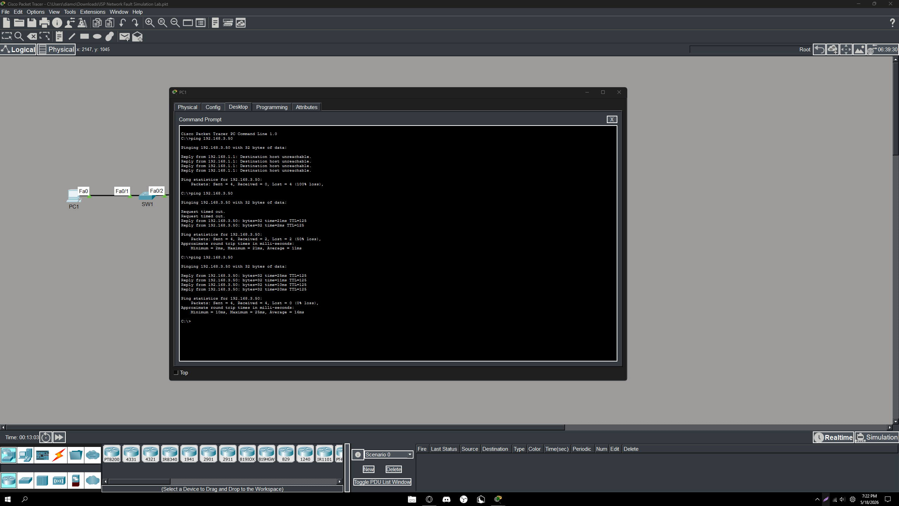
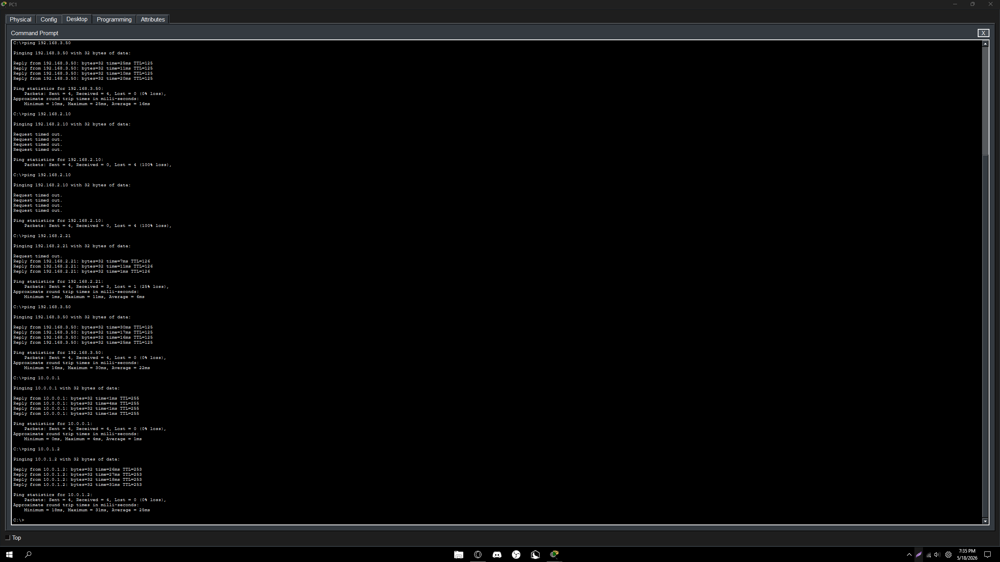

---

## What This Lab Demonstrates
- OSPF dynamic routing and neighbor adjacency across a 3-site ISP topology
- Subnetting and IP address planning for residential and business accounts
- DHCP pool configuration with static IP exclusions for business accounts
- Fault isolation and service restoration for network outage, power failure,
  and router upgrade scenarios
- Structured troubleshooting methodology aligned with NOC ticket workflows
